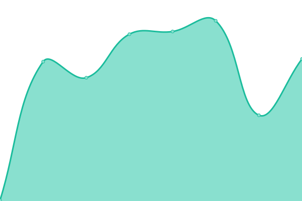

# [📈 Live Status](https://status.redon.tech): <!--live status--> **🟩 All systems operational**

This repository contains the open-source uptime monitor and status page for [Redon Tech](https://redon.tech), powered by [Upptime](https://github.com/upptime/upptime).

With [Upptime](https://upptime.js.org), you can get your own unlimited and free uptime monitor and status page, powered entirely by a GitHub repository. We use [Issues](https://github.com/Redon-Tech/status/issues) as incident reports, [Actions](https://github.com/Redon-Tech/status/actions) as uptime monitors, and [Pages](https://status.redon.tech) for the status page.

<!--start: status pages-->
<!-- This summary is generated by Upptime (https://github.com/upptime/upptime) -->
<!-- Do not edit this manually, your changes will be overwritten -->
<!-- prettier-ignore -->
| URL | Status | History | Response Time | Uptime |
| --- | ------ | ------- | ------------- | ------ |
|  [Website](https://redon.tech) | 🟩 Up | [website.yml](https://github.com/Redon-Tech/status/commits/HEAD/history/website.yml) | 

 123ms
     
 | 

<a href="https://status.redon.tech/history/website">100.00%</a>
    

|  [Server Panel](https://panel.redon.tech) | 🟩 Up | [server-panel.yml](https://github.com/Redon-Tech/status/commits/HEAD/history/server-panel.yml) | 

 225ms
     
 | 

<a href="https://status.redon.tech/history/server-panel">100.00%</a>
    

|  [Content Delivery Network](https://cdn.redon.tech) | 🟩 Up | [content-delivery-network.yml](https://github.com/Redon-Tech/status/commits/HEAD/history/content-delivery-network.yml) | 

 587ms
     
 | 

<a href="https://status.redon.tech/history/content-delivery-network">99.54%</a>
    

|  [Node 0](https://node0.redon.tech:8080) | 🟩 Up | [node-0.yml](https://github.com/Redon-Tech/status/commits/HEAD/history/node-0.yml) | 

 214ms
     
 | 

<a href="https://status.redon.tech/history/node-0">100.00%</a>
    

|  [Node 4](https://node4.redon.tech:8080) | 🟩 Up | [node-4.yml](https://github.com/Redon-Tech/status/commits/HEAD/history/node-4.yml) | 

 169ms
     
 | 

<a href="https://status.redon.tech/history/node-4">100.00%</a>
    

|  [Node 5](https://node5.redon.tech:8080) | 🟩 Up | [node-5.yml](https://github.com/Redon-Tech/status/commits/HEAD/history/node-5.yml) | 

 197ms
     
 | 

<a href="https://status.redon.tech/history/node-5">100.00%</a>
    

|  [Email Server](https://mail.redon.tech) | 🟩 Up | [email-server.yml](https://github.com/Redon-Tech/status/commits/HEAD/history/email-server.yml) | 

 187ms
     
 | 

<a href="https://status.redon.tech/history/email-server">100.00%</a>
    

<!--end: status pages-->

[**Visit our status website →**](https://status.redon.tech)

## 📄 License

- Powered by: [Upptime](https://github.com/upptime/upptime)
- Code: [MIT](./LICENSE) © [Anand Chowdhary](https://anandchowdhary.com), supported by [Pabio](https://pabio.com)
- Data in the `./history` directory: [Open Database License](https://opendatacommons.org/licenses/odbl/1-0/)
